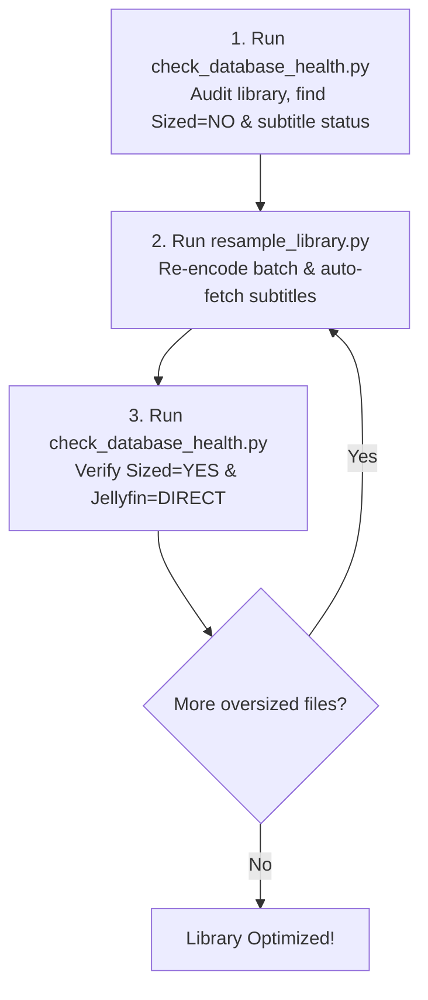

# movie_Scraper

A comprehensive movie collection management and optimization toolkit. It combines an SQLite database (`IMDB_Films.db`) with a Tkinter graphical user interface, automated IMDb metadata scraping, video library health audits, automated subtitle downloading and visual verification, and batch video resampling/compression using FFmpeg.

---

## Workflow: Alternating Resample & Database Health Audits

When maintaining and compressing a large movie library (e.g., converting oversized rips into optimized H.264 files suitable for older hardware and universal Jellyfin direct-play), the primary workflow alternates between **`resample_library.py`** and **`check_database_health.py`**:



### 1. Audit Library Health (`check_database_health.py`)
Run a library audit to inspect video resolutions, file sizes, subtitle formats, and Jellyfin compatibility:
```bash
# Check database health sorted by most recent files:
python3 check_database_health.py --recent --show-only matched

# Or inspect the largest files first:
python3 check_database_health.py --size --show-only matched
```
Review the color-coded table:
* **Red / None (`Sub: None`):** No English subtitles available for this movie.
* **Yellow / Transcode (`Jellyfin: TRANSCODE`):** Bitmapped subtitles (VOBSUB / DVD) that force CPU transcoding on smart TVs; need text `.srt` sidecars.
* **Orange / NO (`Sized: NO`):** File size exceeds target threshold for its resolution (e.g., 480p file > 2.0 GB).
* **Green / YES (`Sized: YES` & `Jellyfin: DIRECT`):** Optimal file size, H.264 video, and direct-play text subtitles.

### 2. Resample Candidates (`resample_library.py`)
Batch process oversized candidates (or a specific movie) with optimal H.264 settings, automatic 120 fps timestamp normalization, backup retention, and automatic English `.srt` downloading:
```bash
# Process the 3 largest oversized movies:
python3 resample_library.py --max-files 3 --sort-by size_desc

# Or dry-run preview:
python3 resample_library.py --max-files 3 --sort-by size_desc --dry-run
```
* **Caffeine Prompt:** For batch runs (> 5 movies), a reminder dialog prompts you to enable Caffeine and disable automated suspend (`suspend_until`) before long-running encodings begin.
* **Backup Management:** Original video files are backed up as `.bak`. The script automatically maintains a rolling limit (default: $\le 50$ backups) to prevent disk exhaustion.
* **Subtitles:** Automatically checks and downloads sidecar `.en.srt` files for any video with missing or bitmapped subtitles.

### 3. Verify Results (`check_database_health.py`)
Re-run `check_database_health.py` to confirm:
* The resampled movies now show **`Sized: YES`**.
* The subtitles display **`SRT`** or **`Text`** with **`Jellyfin: DIRECT`**.
* Disk space savings are accurately reflected in the library totals.

---

## FFmpeg Real-Time Progress & PyCharm Run Tabs

`resample_library.py` streams live FFmpeg encoding status (`time=00:14:22 / 01:45:10 (13.7%) | fps=52 | speed=2.15x`) directly through Python using FFmpeg's `-progress pipe:1` interface.

### Benefits
* **No Terminal Emulation Needed:** Raw carriage returns (`\r`) from FFmpeg are parsed and converted to cleanly flushed status lines ending with standard newlines (`\n`), preventing console freezing in PyCharm, standard shells, and headless scripts.
* **Seamless Multi-Tab Coexistence:** Because `resample_library.py` does not require "Emulate terminal in output console", both `resample_library.py` and `check_database_health.py` run in PyCharm's standard IDE console. This allows both tabs to stay pinned side-by-side in the Run tool window without either tab closing or conflicting.

---

## Project Script Overview

Every `.py` file in this repository serves a specific role in the collection management, scraping, audit, and transcoding workflow:

| File | Purpose |
| :--- | :--- |
| **`check_database_health.py`** | Comprehensive health auditing CLI for the video library and database. Compares `IMDB_Films.db` entries against files on disk in `/media/daveg/Lib/Movies`, categorizing them into Matched, Missing, and Unmatched. Inspects video resolution, framerate, file size bounds (`Sized`), subtitle formats (`Text`, `Bitmap`, `SRT`, `None`), Jellyfin streaming compatibility (`DIRECT` vs `TRANSCODE`), and manages backup `.bak` pruning. Supports flexible CLI arguments or IDE execution via `main(...)`. |
| **`resample_library.py`** | Automated FFmpeg batch transcoding engine. Scans the movie library for oversized files (`Sized=NO`), normalizes problematic container timestamps (e.g. 120 fps metadata bugs), re-encodes to CRF 20 H.264 (`libx264`) for maximum hardware compatibility, preserves audio tracks, fetches missing `.en.srt` sidecars, visually verifies subtitles, and manages a rolling `.bak` backup directory. |
| **`fetch_subtitles.py`** | Automated subtitle search and downloader. Queries IMDb IDs and titles against YTS Subtitles and OpenSubtitles REST APIs, downloads English `.srt` files, cleans up UTF-8 encoding (stripping BOMs), and saves clean sidecars alongside video files for seamless direct-play on Jellyfin and smart TVs. |
| **`verify_jellyfin_subtitles.py`** | Automated subtitle verification tool using multimodal AI. Extracts audio/dialogue cues from internal tracks or `.srt` sidecars, captures video frames at precise timestamps using FFmpeg, and queries Google Gemini Vision (`gemini-2.5-flash`) to confirm that subtitles actually render visibly on screen. |
| **`checks_subtitles_vision.py`** | Command-line testing utility for verifying subtitle visibility on specific video files or test batches using Gemini Vision frame inspection. |
| **`GUI_sqlite_scrape.py`** | Main Tkinter graphical user interface application. Allows browsing, searching, editing, and scraping movie information from IMDb directly into the local SQLite database (`IMDB_Films.db`). Tracks view dates, ratings, and physical/digital ownership. |
| **`sqlite_scrape_util.py`** | Utility library supporting `GUI_sqlite_scrape.py`. Handles SQLite database queries, table schema initialization, IMDb web scraping parsing routines, and record sanitization. |
| **`Colors.py`** | ANSI terminal color and styling definitions (green, red, yellow, bold, cyan, reset) used to format terminal outputs, summary tables, and warning banners across CLI tools. |
| **`GitHub_util.py`** | Git automation helper script for managing local repository status, committing updates, and synchronizing with remote GitHub repositories. |
| **`install.py`** | Project initialization and dependency setup script. Configures virtual environment packages, validates database paths, and verifies local prerequisites. |
| **`setuplinux.py`** | Linux platform configuration script. Handles desktop launchers, file associations, and environment-specific path configurations. |
| **`custom_sort_treeview_ex.py`** | UI component demonstrating multi-column custom sorting algorithms for Tkinter `ttk.Treeview` tables. |
| **`dep_dropdns_listbox_ex.py`** | UI component demonstrating dependent cascading dropdowns and synchronized listbox selections in Tkinter. |
| **`tree_search_ex.py`** | UI component demonstrating real-time search, regex filtering, and item highlighting within Tkinter Treeview widgets. |

---

## Installation & Setup

1. **Clone the repository:**
   ```bash
   git clone https://github.com/davegutz/movie_Scraper.git
   cd movie_Scraper
   ```
2. **Open in PyCharm:**
   * Open the project directory in PyCharm.
   * Configure a Python 3 virtual environment (`.venv`).
3. **Install dependencies:**
   ```bash
   pip install -r requirements.txt  # or run install.py
   ```
4. **Prerequisites:**
   * **FFmpeg / FFprobe:** Required for library audits and resampling:
     ```bash
     sudo apt install ffmpeg
     ```
   * **Database Browser (Optional):** [DB Browser for SQLite](https://sqlitebrowser.org/dl/) for manual inspection of `IMDB_Films.db`.
