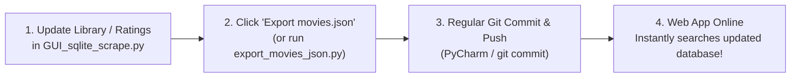

# Export Git Files: Setup to Remotely Read Database

This guide explains how `movies.json` and `movie_search_app.html` work together through your repository so that whenever you make a regular `git commit` and `git push`, your movie search web app updates online automatically.

---

## 1. How It Works

1. **Local Export (`movies.json`)**:
   - The button **"Export movies.json"** in [`GUI_sqlite_scrape.py`](GUI_sqlite_scrape.py) exports all records from your local SQLite database (`IMDB_Films.db`) to `movies.json` in the project folder.
   - You can also run `python3 export_movies_json.py` directly from the terminal or PyCharm.
2. **Standard Git Commit & Push**:
   - You commit and push using your normal workflow (PyCharm Git tool, Git CLI, or IDE).
   - Once pushed to GitHub (`davegutz/movie_Scraper`), `movies.json` and `movie_search_app.html` are publicly updated on GitHub.
3. **Web / Mobile App Reads from GitHub**:
   - [`movie_search_app.html`](movie_search_app.html) automatically fetches `movies.json` directly from the repository on GitHub (`https://raw.githubusercontent.com/davegutz/movie_Scraper/master/movies.json` or relative path when hosted via GitHub Pages).

---

## 2. Normal Day-to-Day Workflow



1. Modify your movie collection in `GUI_sqlite_scrape.py`.
2. Click **"Export movies.json"** (on the bottom-right panel of the GUI).
3. Do your standard git commit and push:
   ```bash
   git add movies.json
   git commit -m "Update movies.json"
   git push
   ```

---

## 3. Accessing the Search App on Android & Web

### Option 1: GitHub Pages (Direct Web Link)
1. In your GitHub repository, go to **Settings ➔ Pages**.
2. Under **Branch**, select `master` (or `main`) and `/ (root)`, then click **Save**.
3. Open your custom URL on any phone, tablet, or browser:
   ```
   https://davegutz.github.io/movie_Scraper/movie_search_app.html
   ```
4. **Android / iOS Home Screen App**:
   - Open the link in Chrome or Safari.
   - Tap **Menu (⋮)** ➔ **Add to Home screen** / **Install App**.
   - It will install as a standalone app with instant search, sorting, and offline caching.

### Option 2: Standalone Local / Raw File
You can also open [`movie_search_app.html`](movie_search_app.html) directly from your local filesystem or email it as a standalone HTML attachment to any device. It will automatically load the live database from GitHub Raw.
